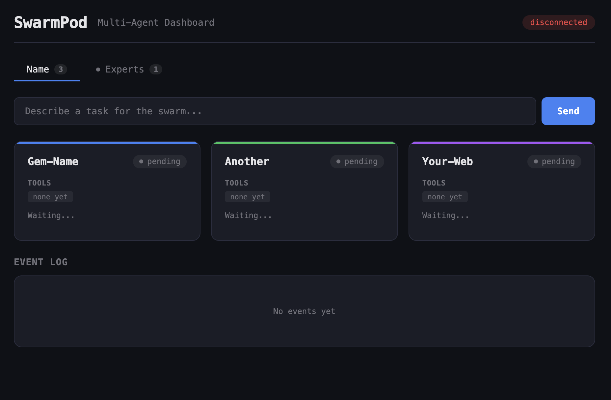

# SwarmPod-Gem



A mountable Rails engine that provides a real-time multi-agent orchestration dashboard. Multiple Claude-powered agents work in parallel, organized by Gemfile groups, with live status updates streamed to your browser.

## Quickstart

Get running with Docker in three commands:

```bash
git clone https://github.com/laquereric/swarmpod-gem.git
cd swarmpod-gem
cp secrets_example/ANTHROPIC_API_KEY.sh secrets/ANTHROPIC_API_KEY.sh
# Edit secrets/ANTHROPIC_API_KEY.sh with your key from console.anthropic.com
source secrets/ANTHROPIC_API_KEY.sh
bin/up
```

Open **http://localhost:4000** in your browser.

**Prerequisites:** Git and Docker. See the full platform-specific guides:

- [Mac Quickstart](QUICKSTART_mac.md) -- from a fresh Mac to running dashboard
- [Linux Quickstart](QUICKSTART_linux.md) -- Ubuntu/Debian and Fedora/RHEL
- [Windows Quickstart](QUICKSTART_windows.md) -- via WSL2

## Installation (as a Rails Engine)

Add to your Gemfile:

```ruby
gem "swarmpod-gem", path: "../swarmpod-gem"
```

Mount in `config/routes.rb`:

```ruby
mount SwarmpodGem::Engine, at: "/swarmpod"
```

## Configuration

```ruby
SwarmpodGem.configure do |config|
  config.workspace     = "/workspace"
  config.output        = "/output"
  config.gems_dir      = "/gems"
  config.gemfile_path  = "/path/to/Gemfile"
  config.prompts_dir   = "/path/to/prompts"
  config.auto_boot     = true
  config.clone_timeout = 60
  config.max_events    = 50
  config.debounce_ms   = 100
end
```

All settings can also be set via environment variables:

| Variable | Default | Description |
|----------|---------|-------------|
| `ANTHROPIC_API_KEY` | (required) | Your Anthropic API key |
| `WORKSPACE` | `/workspace` | Project directory |
| `OUTPUT` | `/output` | Agent output directory |
| `GEMS_DIR` | `/gems` | Cached gems directory |
| `PORT` | `4000` | Application port |
| `SWARMPOD_GEMFILE` | - | Path to Gemfile defining agent groups |
| `SWARMPOD_PROMPTS` | - | Path to prompts directory |
| `SWARMPOD_AUTO_BOOT` | `true` | Auto-start orchestrator on launch |
| `SWARMPOD_CLONE_TIMEOUT` | `60` | Git clone timeout in seconds |
| `SWARMPOD_MAX_EVENTS` | `50` | Max events per agent in state |
| `SWARMPOD_DEBOUNCE_MS` | `100` | Broadcast debounce delay |
| `RAILS_ENV` | `production` | Rails environment |
| `LOG_LEVEL` | `info` | Logging verbosity |

## Docker

```bash
bin/up      # Build and start on port 4000
bin/down    # Stop containers
```

## Architecture

- **ActionCable** for real-time WebSocket state broadcast (async adapter, no Redis required)
- **Open3.popen3** spawns Claude CLI subprocesses per agent
- **MonitorMixin** provides thread-safe state management
- **Sprockets** handles the asset pipeline
- **Gemfile groups** define agent tabs (web, experts, foci)
- **NDJSON streaming** parses agent output in real time
- **Broadcast debouncer** throttles WebSocket updates for performance

## License

MIT
